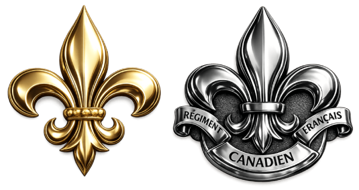
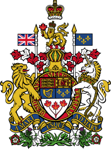

import Tabs from '@theme/Tabs';
import TabItem from '@theme/TabItem';

## The Canadian Crown 👑

✅ **The Crown**: symbol of the state in Canada for **400 years**

✅ Canada has been a **constitutional monarchy** since **Confederation in 1867**
- Start from Queen Victoria’s reign, 1867
- Queen Elizabeth II, since **1952**
  - Golden Jubilee (50 years): **2002**
  - Diamond Jubilee (60 years): **2012**

✅ The Crown: **symbol of Government**, including:
- Parliament
- Provincial legislatures
- Courts
- Police services
- Canadian Forces

## Flags in Canada 🇨🇦

✅ The current Canadian flag was first raised in **1965**
- ✅ Red–white–red design: inspired by the **Royal Military College** flag (founded 1876 in Kingston)
- ✅ Red and white: colours of **France and England** since the Middle Ages, national colours of Canada since **1921**

✅ The **Union Jack** 🇬🇧: official **Royal Flag**

✅ The **Canadian Red Ensign** was Canada's flag for about **100 years**

✅ Provinces and territories each have their **own flags**

## The Maple Leaf 🍁

✅ Canada’s **best-known symbol**

✅ Adopted by French-Canadians since the **1700s**

✅ On uniforms and insignia (and military insignia) since the **1850s**

✅ Carved into soldiers’ headstones 🪦 in Canada and overseas

## The Fleur-de-lys (lily flower) ⚜️

✅ Adopted by the French king in **496**
- 👍 Symbol of **French royalty** for over **1,000 years**, including **New France**

✅ Revived at **Confederation**
- Included in the **Canadian Red Ensign**

✅ In **1948**, Quebec adopted its own flag, based on the **Cross** and the **Fleur-de-lys** 

## Coat of Arms and Motto

✅ National pride after the First World War

✅ Motto **A Mari Usque Ad Mare**: meaning **"from sea to sea"**

✅ **Coat of arms**: includes symbols of England, France, Scotland, Ireland, and red maple leaves

✅ Appears on dollar bills, government documents, public buildings

## Parliament Buildings 🏛️

✅ Located in **Ottawa**, completed in the **1860s**
- ✅ The towers, arches, sculptures and stained-glass of the Parliament Buildings embody the **French, English and Aboriginal traditions and the Gothic Revival architecture** popular in the time of Queen Victoria
- ✅ **Centre Block**: is destroyed by accidental fire in **1916**, rebuilt in **1922**
- ✅ **Library of Parliament** is the remaining part of the **original** building
- ✅ **The Peace Tower** was completed in 1927 in **memory of the First World War**. The **Memorial Chamber** within the tower contains **Books of Remembrance**, written the names of Canadians who died serving in wars or on duty

✅ Provincial legislatures:
- **Quebec National Assembly**: French Second Empire style
- **Other provinces' legislatures**: Baroque, Romanesque, neoclassical style, reflect **Greco-Roman democratic heritage**

## Popular Sports

✅ **Hockey** 🏒
- Most popular spectator sport
- National **winter sport**
- Developed in Canada in the **1800s**
- Young Canadians love hockey: play at schools, road/street hockey, collect hockey cards, etc

✅ **Stanley Cup**
- Awarded by the **NHL (National Hockey League)**
- Donated by **Lord Stanley** (the Governor General) in **1892**

✅ **Clarkson Cup**
- Women’s hockey championship
- Established by **Adrienne Clarkson** (26th Governor General) in **2005**

✅ Other popular sports:
- Canadian football: **2nd most popular**
- Curling: introduced by Scottish pioneers
- Lacrosse (Aboriginal origin): **official summer sport**,
- Soccer: **most registered players**

## The Beaver 🦫

✅ Early symbol of the **Hudson’s Bay Company** centuries ago

✅ **1834** emblem of the St. Jean Baptiste Society, a French-Canadian patriotic association; also adopted by other groups

👍 Symbol of **hard work and industry**

✅ Appears on: five-cent coin (the **nickel**), coats of arms of Saskatchewan and Alberta, city arms (e.g., Montreal, Toronto)

## Canada’s Official Languages

✅ Official languages: **English and French**

✅ English speakers (Anglophones) and French speakers (Francophones) have lived together in Canada for **over 300 years**

✅ Must have **adequate knowledge of English or French** to become a Canadian citizen (exemption for applicants **over 55 years old**)

✅ *Official Languages Act* (1969):
- **Equality of English and French** in Parliament and government
- Support **minority language communities**
- Promote language equality in society

## National Anthem 🫡

✅ **O Canada** was proclaimed **national anthem in 1980**
- **First sung in Québec City** in 1880
- **English and French versions** have different wordings

:::info[Lyrics]

<Tabs groupId="languages">
  <TabItem value="english" label="English version" default>
### **O Canada**  

O Canada! Our home and native land!  
True patriot love in all thy sons command  
With glowing hearts we see thee rise  
The true North strong and free!  
From far and wide, O Canada we stand   
on guard for thee  
God keep our land glorious and free!    
O Canada, we stand on guard for thee  
O Canada, we stand on guard for thee
  </TabItem>
  <TabItem value="french" label="French version">
### **Ô Canada**  

O Canada! Terre de nos aïeux,  
Ton front est ceint de fleurons glorieux!  
Car ton bras sait porter l’épée,  
Il sait porter la croix!  
Ton histoire est une épopée  
Des plus brillants exploits.  
Et ta valeur, de foi trempée,  
Protégera nos foyers et nos droits.  
Protégera nos foyers et nos droits.  
  </TabItem>
</Tabs>

:::

## Royal Anthem

✅ Royal Anthem: **“God Save the Queen (or King)”**
- Used to honour the **Sovereign**
- May be played or sung on official occasions

:::info[Lyrics]

<Tabs groupId="languages">
  <TabItem value="english" label="English version" default>
### **God Save the Queen**  

God Save our gracious Queen!  
Long live our noble Queen!  
God save The Queen!  
Send her victorious,  
Happy and glorious,  
Long to reign over us,  
God save The Queen!  
  </TabItem>
  <TabItem value="french" label="French version">
### **Dieu protège la Reine**  

Dieu protège la Reine!  
De sa main souveraine!  
Vive la Reine!  
Qu’un règne glorieux,  
Long et victorieux,  
Rende son peuple heureux,  
Vive la Reine!  
  </TabItem>
</Tabs>

:::

## The Order of Canada and Other Honours

✅ Outstanding citizens are awarded with **honours**, including:
- Orders
- Decorations
- Medals

✅ In 1967 (centennial of Confederation) Canada started its own honours system with the **Order of Canada**, after using British honours for many years.

✅ Canadians may **nominate** others for honours

## The Victoria Cross 🎖️

✅ **Highest military honour** in Canada, awared for exceptional bravery, valour, self-sacrifice, extreme devotion to duty in combat

✅ Awarded to **96 Canadians** since **1854**

✅ Notable recipients:
- Lieutenant **Alexander Roberts Dunn** (Toronto): **first Canadian V.C**. (Crimean War, 1854)
- **Able Seaman William Hall** of Horton, Nova Scotia: **first Black V.C**. recipient (Indian Rebellion, 1857)
- **Corporal Filip Konowal** (Ukraine): **first V.C. recipient not born in British Empire** (Battle of Hill 70, 1917)
- Captain Billy Bishop (Owen Sound, Ontario): WWI flying ace, later honoured Air Marshal by RCAF
- Captain Paul Triquet of Cabano, Quebec: leading his men and tanks in WWII (Italy, 1943), later a Brigadier
- Lieutenant **Robert Hampton Gray** (Trail, BC): bombing & sinking a Japanese warship few days efore end of WWII, **last Canadian V.C**. recipient (1945)

## National Public Holidays and Other Important Dates

- 🎆 New Year’s Day — January 1
- 🏛️ Sir John A. Macdonald Day — January 11
- ✝️ Good Friday — Friday before Easter Sunday
- 🐣 Easter Monday — Monday after Easter Sunday
- 🎖️ Vimy Day — April 9
- 👑 Victoria Day — Monday before May 25 (Sovereign’s Birthday)
- ️⚜️ Fête Nationale (Quebec) — June 24 (Feast of St. John the Baptist)
- 🇨🇦 Canada Day — July 1
- 👷 Labour Day — First Monday in September  
- 🙏 Thanksgiving — Second Monday in October  
- ️🕯️ Remembrance Day — November 11
- 🇫🇷 Sir Wilfrid Laurier Day — November 20  
- 🎄 Christmas Day — December 25
- 🎁 Boxing Day — December 26
