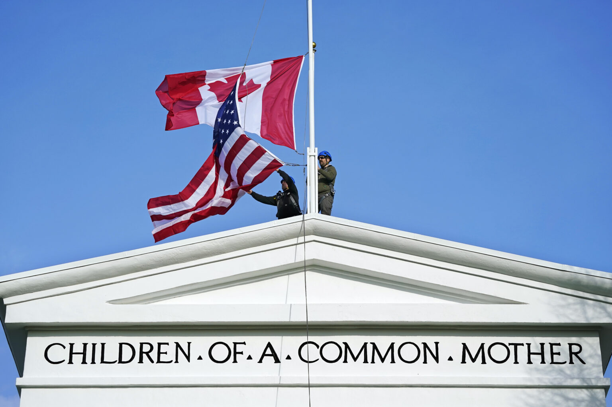

## A Trading Nation

✅ Trading/Commerce is engine of economic growth, maintaining **standard of living**

✅ **1988: free trade with the United States**

✅ **1994**: **Mexico joined**, creating **NAFTA (North American Free Trade Agreement)**
- Involved **over 444 million people**
- Over $1 trillion in merchandise trade in 2008

**Canada in the global economy**
- ✅ **One of the 10 largest economies** in the world
- ✅ Member of the **G8** group
- Other G8 countries: United States, Germany, United Kingdom, Italy, France, Japan, Russia

## Canada’s Economy Includes Three Main Types of Industries:

✅ **1. Service industries**, over **75% of working Canadians** in:
- Transportation
- Education
- Health care
- Construction
- Banking
- Communications
- Retail services
- Tourism
- Government

✅ **2. Manufacturing industries**, making products for **Canada and international markets**
- Paper
- High-technology equipment
- Aerospace technology
- Automobiles
- Machinery
- Food
- Clothing
- ✅ **Largest trading partner**: **United States**

✅ **3. Natural resources industries**
- Forestry
- Fishing
- Agriculture
- Mining
- Energy
- ✅ Important to **Canada’s history and development**
- ✅ Many regions still depend on natural resources
- ✅ A **large share of exports** are natural resource commodities

## Canada – U.S. relationship
✅ Canada and the U.S. are **each other’s largest trading partners**

✅ **Over 3/4 of Canadian exports** go to the **United States**

✅ **Largest bilateral trading relationship in the world**

✅ Canada – U.S. supply chains are **integrated and competitive globally**

👍 **Major Canadian exports to the U.S.**
- Energy products
- Industrial goods
- Machinery and equipment
- Automotive
- Agricultural
- Fishing and forestry
- Consumer goods

✅ The Canada – U.S. border is known as **“the world’s longest undefended border”**
- Millions of Canadians and Americans cross the border every year

✅ The **Peace Arch** at Blaine, Washington symbolizes Canada - U.S. close ties and common interests
  - Inscribed with: **"Children of a common mother"** and **"Brethren dwelling together in unity"**

